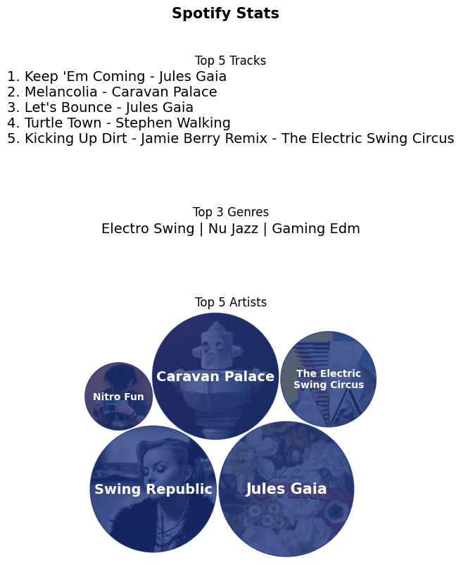

# Spotify Stats with Python and Spotipy

## Description
Random demo project using the Spotipy library to create a simple little visual similar to Spotify wrapped, but limited to only the top tracks, top genres, and top artists.

NOTE: This project is mirrored on both my GitHub and GitLab repositories as it is a demo.

## Visuals

## Installation
* Create a virtual environment using your favorite tool:
    * Conda: `conda create --name spotipy python=3.9`
    * venv: `python -m venv venv`
* Activate the environment
    * Conda: `conda activate spotipy`
    * venv: `venv\Scripts\activate` (Windows)
    * venv: `source venv/bin/activate` (MacOS)
* Install the requirements
    * `python -m pip install requirements.txt`
* Spotify Credentials
    * Log in to or create an account for [Spotify for Developers](https://developer.spotify.com/).
    * Click on your profile badge at the top right and go to your Dashboard.
    * Create a new app.
    * Provide app information:
        * App name
        * App description
        * Website can be blank
        * Redirect URI can be http://localhost:3000 (or similar) if you are just working locally
    * Click the Settings button to see your Client ID and Secret
    * Create a `.env` file in the local directory of this project with the following information and your own Client ID and Secret (and URI if you entered something different).
        * SPOTIPY_CLIENT_ID='<YOUR_ID_HERE>'
        * SPOTIPY_CLIENT_SECRET='<YOUR_SECRET_HERE'
        * SPOTIPY_REDIRECT_URI='http://localhost:3000'

## Usage
Run the `main.py` file in your editor of choice.

## Authors and acknowledgment

### Tools/Libraries
* [Spotify for Developers](https://developer.spotify.com/)
* [Spotipy](https://spotipy.readthedocs.io/)

## License
MIT - this is just for demonstration purposes
